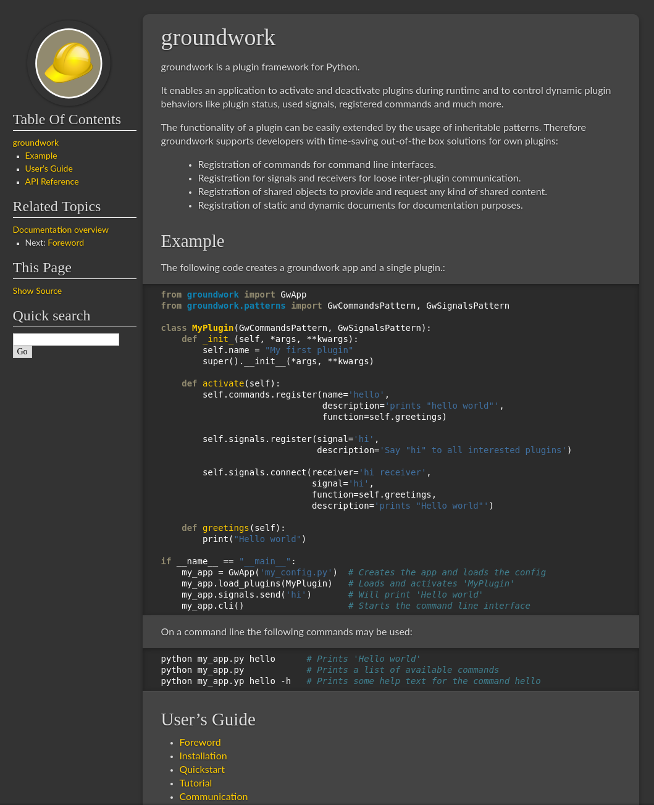

gwTheme Sphinx Style
====================

This repository contains sphinx styles, which are use by most groundwork related projects.
It is a drivative of Kenneth Reitz's themes for his projects and of Mitsuhiko's themes for Flask and Flask related
projects.  To use this style in your Sphinx documentation, follow this guide:

1. put this folder as _themes into your docs folder.  Alternatively
   you can also use git submodules to check out the contents there.

2. add this to your conf.py: ::

	sys.path.append(os.path.abspath('_themes'))
	html_theme_path = ['_themes']
	html_theme = 'gw'

The following themes exist:

**gw**
	the standard groundwork documentation theme for any kind of projects

Screenshot
----------

